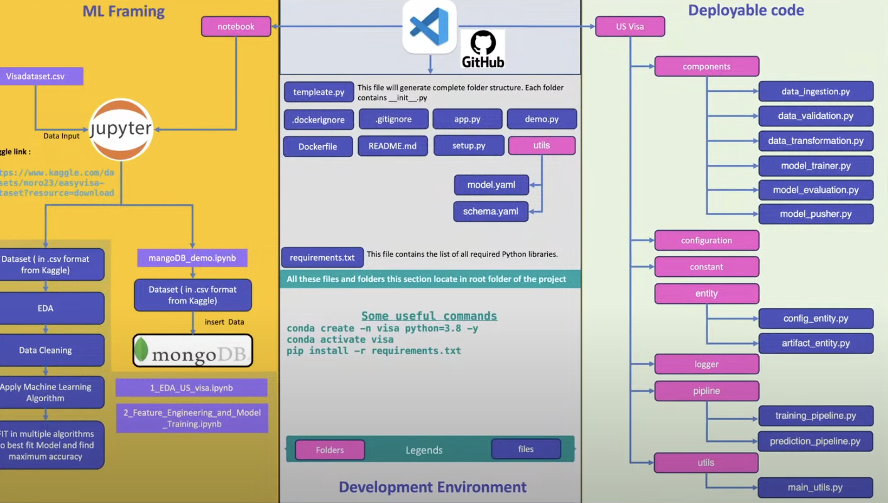

US Visa Approval Prediction 

Project Overview:
 * Undersstanding the Problem Statement 

 * Understanding the solution 

 * Code understanding & walkthrough 

 * Understanding the Deployment 


Deployment:
 * Docker 
 * Cloud Services 
 * Adding self hosted runner 
 * workflows 


Problme Statement:

US visa approval status

Given certain set of features such as (continent, education, job_experience, training, employment, current age etc .) 

We have to predict weather the application for the visa will be approved or not. 


Features:
Continent: Asia, Africa, North America, Europe, South America, Oceania 

Education: High Scool, Master's Degree, Bachelor's, Doctorate 

Job Experience: Yes, No

Required Training: Yes, No 
Number of employess: 15000 to 40000 
Region of employment: West, Northeast, South, Midwest, Island,

Prevailing Wage: 700 to 70000 

Contract Tenure: Hour, Year, Week, Month 

Full time : Yes, No

Age of company: 15 to 180 


Soluteion Scope:
This can be used on real life by US visa applicants so that they can improve their Resume and criteria for the approval process. 


Solution Approach:

1.) Machine Learning: ML Classification Algorithms 

2.) Deep Learning: Custom ANN with sigmoid activation Function 


# Solution Proposed 

We will be using ML
1.) Load the data from DB
2.) Perform EDA and feature engineering to select the desirable features. 
3.) Fit the ML classification Algorithm and find out which one performs better. 

4.) Select top few and tune hyperparameters.

5.) Select the bet model based on desired metrics.


Steps:- 

1.) First create template.py 
 
 now run :- python template.py 


2.) use mlops tools:-  evidently ai to detect data drift 


## Git commands

```bash
git add .

git commit -m "Updated"

git push origin main
```

## How to run?

```bash
conda create -n visa python=3.8 -y
```

```bash
conda activate visa
```

```bash
pip install -r requirements.txt
```


## Workflow:

1. constants
2. entity
3. components
4. pipeline
5. Main file


### Export the  environment variable
```bash


export MONGODB_URL="mongodb+srv://<username>:<password>...."

export AWS_ACCESS_KEY_ID=<AWS_ACCESS_KEY_ID>

export AWS_SECRET_ACCESS_KEY=<AWS_SECRET_ACCESS_KEY>


```


# AWS-CICD-Deployment-with-Github-Actions

## 1. Login to AWS console.

## 2. Create IAM user for deployment

	#with specific access

	1. EC2 access : It is virtual machine

	2. ECR: Elastic Container registry to save your docker image in aws


	#Description: About the deployment

	1. Build docker image of the source code

	2. Push your docker image to ECR

	3. Launch Your EC2 

	4. Pull Your image from ECR in EC2

	5. Lauch your docker image in EC2

	#Policy:

	1. AmazonEC2ContainerRegistryFullAccess

	2. AmazonEC2FullAccess

	
## 3. Create ECR repo to store/save docker image
    - Save the URI: 315865595366.dkr.ecr.us-east-1.amazonaws.com/visarepo

	
## 4. Create EC2 machine (Ubuntu) 

## 5. Open EC2 and Install docker in EC2 Machine:
	
	
	#optinal

	sudo apt-get update -y

	sudo apt-get upgrade
	
	#required

	curl -fsSL https://get.docker.com -o get-docker.sh

	sudo sh get-docker.sh

	sudo usermod -aG docker ubuntu

	newgrp docker
	
# 6. Configure EC2 as self-hosted runner:
    setting>actions>runner>new self hosted runner> choose os> then run command one by one


# 7. Setup github secrets:

   - AWS_ACCESS_KEY_ID
   - AWS_SECRET_ACCESS_KEY
   - AWS_DEFAULT_REGION
   - ECR_REPO

    


